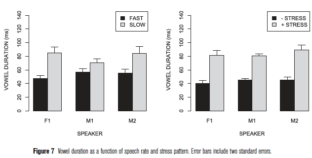
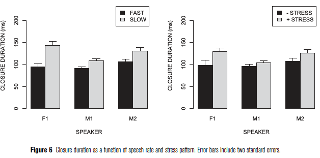
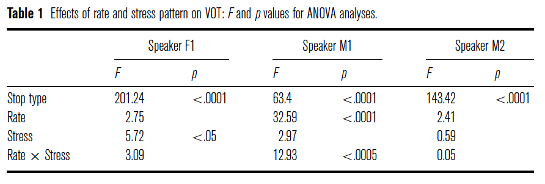
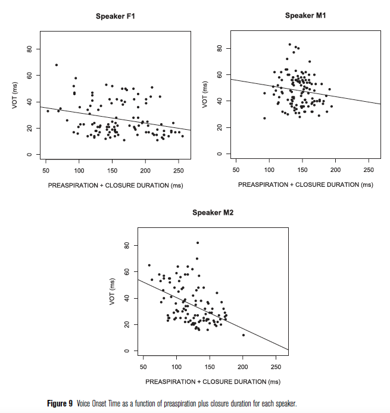

# Introduction 

+ Phenomenon under investigation: /s/-aspiration

+ Aspirated [s] is found in many varieties of Spanish **&rarr;** Western Andalusian Spanish (WAS)

+ Simple segmental rule: /s/ > [h] **&rarr;** .black[Question]: Is this rule representative of WAS? Why?

---
# Introduction 

+ Phenomenon under investigation: /s/-aspiration

+ Aspirated [s] is found in many varieties of Spanish **&rarr;** Western Andalusian Spanish (WAS)

+ Simple segmental rule: /s/ > [h] **&rarr;** .black[Question]: Is this rule representative of WAS? Why?
    + This description is 'too simplistic'; there is a lot of variation:
      + It can be elided in utterance-final position
      + It is usually heard in word-final position before a vowel
      + It is coarticulated in different ways with the upcoming consonant (in preconsonantal position):
          + Gemination (in front of nasals, laterals, and other fricatives)
          + Long voiced fricatives (in front of voiced stops)
          
+ Torreira (2007a) and Torreira (2007b)
    + Realization of [h + voiceless stop] clusters with long pre- and postaspirated stop clusters as a dialect-specific feature of WAS

---
# The present study
+ RQs (I propose, not explicitly stated):

  + Are aspirated stops in WAS result from a coarticulatory process or from a segmental rule?
  
    + What are the effects of speech rate and stress patterns on closure and vowel duration?
    
    + What are the effects of speech rate and stress patterns on VOT?
    
    + Is there a negative or positive correlation between VOT and the sum of aspiration and closure duration?

---
# Methods
+ **Participants**: 3 native speakers of WAS (from Cádiz)

+ **Task**: Read some sentences

+ **Stimuli**: 60 sentences **&rarr;** "Digo X para mí"
  + **Target words**: 
      + Bisyllabic verbs with infinitive forms ending in -ascar (*tascar*, *mascar*, *cascar*), -aspar (*raspar*), -astar (*pastar*, *bastar*, *gastar*)
      + 2 forms / stress patterns: *raspo* vs *raspó* **&rarr;** Lexical stress (paroxytone vs oxytone)
      + [h + voiceless stop] cluster **&rarr;** 
.black[Question]: Why did the author focus on this cluster?
      + 2 speech rates
      
  + 60 sentences x 2 different speed rates = 120 sentences per speaker
  
  + .black[Question]: Why do they decide to manipulate the speech rate and the stress placement?

---
# Measurements
  + Voice Onset Time
  
  + Vowel Duration
  
  + Closure Duration
  
  + Preaspiration duration

</br>

# Analysis
  + A total of 328 sentences were included in the analysis
  
  + Each speaker was analyzed separately

---
# Main results
  + **VOT values**
    + Differences among participants
    
    + M1 had longer VOTs than the other speakers, especially for [t]
    
    + F1 and M2 had shorter VOTs than M1
    
    + VOT values were higher on average than those reported for Andalusian unaspirated stops (Torreira, 2007a), BUT a *significant number* was short compared to other languages that use postaspiration as a contrastive cue in stops (e.g., Thai)

  + **Assessment of speech rate and stress pattern**
    + Vowel and closure duration were longer in slow speech rate and stressed syllables for all participants
    
    + So... large and consistent effects of speech rate and stress on closure and vowel duration

---
```{r, out.height=300}
#| label: load-figs
#| echo: false 
#| warning: false 
#| message: false




```
---
  + **Effects of rate and stress on VOT**
    + VOT values tended to be *slightly* longer at slow speech rates and in unstressed syllables
    
    + Differences among participants as for the factors that affect VOT values (see Table 1)

    + Stressed stops did not show longer VOT than unstressed stops for any speaker
    
    + So... VOT values did not seem to be significantly affected by rate and stress

```{r}
#| label: load-table
#| echo: false 
#| warning: false 
#| message: false


```

---
  + **Trade-offs between VOT and aspiration + closure duration**
    + First analysis (main predictor)
        + Statistically negative correlations between preaspiration duration and closure duration for participants F1 and M2
        + M1 similar, but not statistically significant
        
    + Second analysis (main predictor + covariates)
      + Statistically negative relationships between VOT values and preaspiration + closure duration for all participants
      
    + So... *quite consistent* negative relationship between VOT and preaspiration and closure duration 

---
```{r, out.width="590px", fig.align='center'}
#| label: load-fig
#| echo: false 
#| warning: false 
#| message: false


```

---
# Discussion
  + Let's go back to the main RQ: Are aspirated stops in WAS result from a coarticulatory process or from a segmental rule?
    + IF from coarticulatory process: 
        + shorter VOT in unstressed syllables and faster speech rates, 
        + positively correlated with speech rate, 
        + trade-offs between VOT and preaspiration and closure durations
    + IF from segmental rule: 
        + longer VOT in stressed syllables and slower speech rates, 
        + negatively correlated with speech rate, 
        + NO trade-offs

  + .black[Question]: So, coarticulatory process or segmental rule?

---
  + Postaspiration in WAS [h + voiceless stop] clusters is the result of extensive articulatory overlap between [h] and the upcoming voiceless stops
  
  + The articulatory overlap account can also explain...
      + variation in pre- and postaspiration in WAS [h + voiceless stop] clusters 
      + differences between WAS and other /s/-aspirating dialects
  
  + However.... it cannot account for the lengthening of the voiceless stops when preceded by [h], compared to other contexts **&rarr;** Glottal gesture corresponding to [h]? 2 gestural mechanisms:
        1.  Realignment of the [h] devoicing gesture with respect to the onset of the supraglottal gesture in upcoming consonants
        2. Lengthening of the supraglottal gesture in upcoming consonants, possibly as a compensation for the realignment mechanism, to preserve the prosodic properties of the affected syllable

.black[Some questions]: 
  + What are your main takeaways of this study? 
  + What did you (dis)like about this study?
